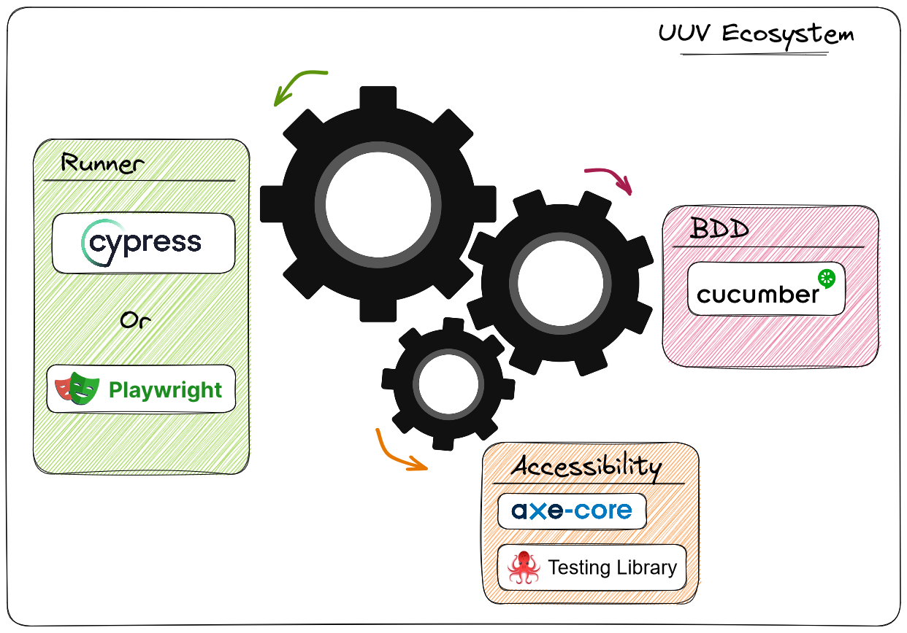

<p align="center">  
<a href="https://orange-opensource.github.io/uuv/">  
<picture>  
  
</picture>  
</a>  
</p>  

# UUV - User centric Usecases Validator
<h3 align="center">  
Discovering your application by usecase validation  
</h3>  

<p align="center">  
Make test writing fast, understandable by any human understanding English or French.  
</p>  

## Benefits
- If used correctly, integrates accessibility from the development stage
- A living documentation is possible because we propose an unified language for developers and non-developers with a rich dictionary of ready-to-use sentences
- @uuv/assistant that facilitates the writing of tests by suggesting the most accessible sentences
- Integrates several runtime engines: Cypress / Playwright
- User-friendly and standardized execution report
  ### <u>Comparison</u>
| Criteria | Cypress | Playwright | Testing library | UUV |  
|:-: |:-: |:-: |:-: |:-: |  
| User centrism | :x: | :heavy_check_mark: | :heavy_check_mark: | :heavy_check_mark: |  
| Native accessibility | :x: | :heavy_check_mark: | :heavy_check_mark: | :heavy_check_mark: |  
| Easy setup configuration for BDD test | :warning: | :warning: | :heavy_minus_sign: | :heavy_check_mark: |  
| Understandable by everyone <br> (included non dev) | :x: | :x: | :x: | :heavy_check_mark: |  

### <u>Syntax example</u>
With this dom example :
  ```html
  <body>
  <h1>Result<h1>
  </body>
```
we see that the sentence proposed by **UUV is the most understandable** of all
| Library | Syntax |
|:--|:--|
| Cypress  | cy.get('result').should('exist') |
| Playwright| await expect(page.getByTitle('Result')).toHaveCount(1) |
| Testing library  | expect(screen.getByTitle(/Result/i)).toBeTruthy() |
| UUV | Then I should see a title named "Result"|

## Documentation
<a href="https://orange-opensource.github.io/uuv/"></a>

## Libraries
<a href="https://www.npmjs.com/package/@uuv/assistant"></a>  
<a href="https://www.npmjs.com/package/@uuv/cypress"></a>  
<a href="https://www.npmjs.com/package/@uuv/playwright"></a>  
<a href="https://www.npmjs.com/package/@uuv/runner-commons"></a>

## Concepts

The `@uuv` library (User centric Usecases Validator) is an ecosystem that simplifies the writing of End to End tests in a BDD approach and a user-centric way.

### The problem

Automated software testing is a growing practice. It adds a better  
level of quality on the code of an application by verifying non-regression or validating use cases.


The `End to End test` is a technique used to verify if an application (web,  
mobile...) behaves as expected, from start to finish. It consists in verifying that the end user can complete the main usage scenarios of the application.

Unlike `unit test` which only aims to verifying the behavior of a function, or  
the `integration test` which consists in making several modules of the application interact with each other in order to see their good cooperation, the `End to End test` allows to check from a browser (for example for web applications), the `End to End test` allows to check from a browser (for example for web applications) the behavior of your application according to a set of use cases.

> During the `E2E test`, the validations consist most of the time in checking the elements returned to the user via the web browser ([DOM](https://developer.mozilla.org/fr/docs/Web/API/Document_Object_Model))

Therefore, several additional questions arise:

- How to clearly express use cases?
- For omnichannel applications, how to check your application on different browsers and devices?  
  For omnichannel applications, how do you check your application on different browsers and devices?**
- How to perform relevant DOM checks from a user perspective

### Our solution

To answer the above issues and many others, our solution is to set up a coherent ecosystem based on tools that are references in their field.



### Dependencies
#### Add dependency to a project
```shell
npm install dependencyName --workspace=packages/runner-playwright
```

## License

[<a href="https://github.com/Orange-OpenSource/uuv/blob/main/LICENSE">  
  
</a>](https://spdx.org/licenses/MIT.html)

This project is licensed under the terms of the [MIT license](https://github.com/Orange-OpenSource/uuv/blob/main/LICENSE).

## Authors

- [@luifr10](https://github.com/luifr10)
- [@stanlee974](https://github.com/stanlee974)
